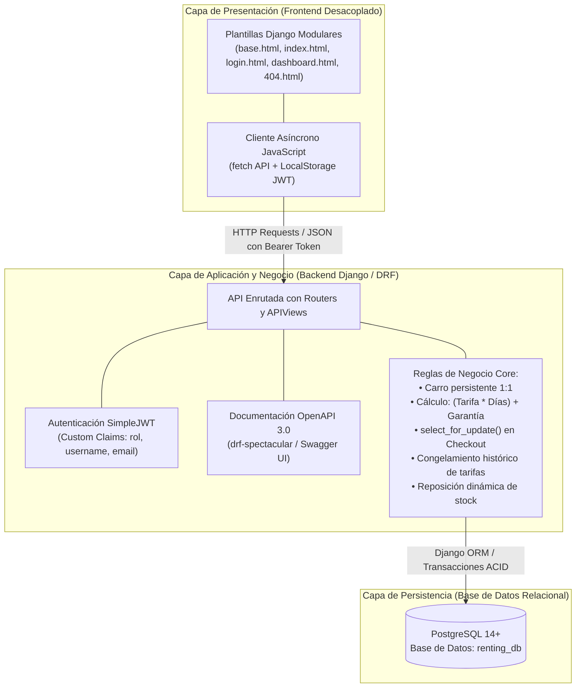

# Sistema de Arriendo de Maquinaria de Construcción - Caso 6

> **Estado del Proyecto:** `Trabajo en Desarrollo (WIP)`  
> **Desarrollador:** Felipe Eduardo Rivas Garrido  
> **Sección Académica:** AP-N4-C2  
> **Institución:** INACAP  
> **Año:** 2026  

---

## 1. Descripción General del Proyecto

El **Sistema de Arriendo de Maquinaria de Construcción (Caso 6)** es una solución empresarial backend-driven desarrollada con el framework **Django** y **Django REST Framework (DRF)**, respaldada por un motor relacional transaccional **PostgreSQL**.

El propósito central del sistema es gestionar de manera robusta y auditable el ciclo comercial y logístico del arriendo de maquinaria y herramientas para la construcción:
- **Empresas Constructoras (`CLIENTE`):** Navegación interactiva de catálogo con búsqueda reactiva, reserva por rango de fechas (fecha de inicio y fecha de término), persistencia de carro de arriendo 1:1 post-cierre de sesión y ejecución transaccional de checkout.
- **Ejecutivos de Arriendos (`ADMINISTRADOR`):** Administración integral del inventario físico (CRUD de maquinaria con carga de imágenes), auditoría de contratos emitidos y transición de estados operativos (`PENDIENTE`, `PAGADO`, `ENTREGADO`, `COMPLETADO`, `CANCELADO`) con reposición controlada de existencias.

---

## 2. Arquitectura y Stack Tecnológico

El proyecto implementa una arquitectura desacoplada donde el backend actúa como una **API RESTful stateless** protegida con tokens JWT, mientras la capa de presentación consume dichos recursos mediante peticiones asíncronas (`fetch`) desde el navegador.



### Componentes del Stack Tecnológico

- **Backend:** **Django 6.1+** y **Django REST Framework (DRF) 3.18+**.
- **Base de Datos:** **PostgreSQL** (`renting_db`), conectada mediante el controlador de alto rendimiento `psycopg2-binary`.
- **Autenticación y Control de Acceso (RBAC):** `djangorestframework-simplejwt` con serializador extendido (`CustomTokenObtainPairSerializer`) que inyecta en el payload del token `access` los claims personalizados:
  - `rol`: Identificador de perfil (`CLIENTE` o `ADMINISTRADOR`).
  - `username`: Nombre de usuario autenticado.
  - `email`: Correo institucional/corporativo.
- **Documentación Interactiva:** OpenAPI 3.0 implementado con `drf-spectacular`, disponible en Swagger UI (`/api/docs/`) y esquema descargable (`/api/schema/`).
- **Frontend Desacoplado:** Sistema multi-pantalla modular basado en plantillas Django (`base.html`, `index.html`, `login.html`, `dashboard.html`, `404.html`) estilizadas con Bootstrap 5. El intercambio de datos con el servidor se realiza de forma asíncrona mediante la API nativa de JavaScript `fetch()`, gestionando el ciclo de vida de los tokens JWT en el almacenamiento local del cliente (`localStorage`).

### Reglas Core de Negocio Implementadas

1. **Persistencia de Carro 1:1 Post-Logout:**  
   El modelo `CarroArriendo` está vinculado de manera exclusiva al usuario mediante una relación `OneToOneField(Usuario, on_delete=models.CASCADE)`. Cuando una empresa constructora inicia sesión desde cualquier equipo, su carro y las fechas planificadas se recuperan íntegramente desde PostgreSQL.
2. **Cálculo Transaccional de Tarifas Diarias + Garantía Fija:**  
   Cada equipo ingresado al carro calcula su subtotal a través de la propiedad del modelo:
   $$\text{Subtotal} = (\text{tarifa\_diaria} \times \text{días\_totales}) + \text{garantía\_fija}$$
   donde $\text{días\_totales} = \max((\text{fecha\_fin} - \text{fecha\_inicio}), 1)$.
3. **Checkout Atómico con Bloqueo de Concurrencia (`select_for_update()`):**  
   Durante el checkout (`/api/contratos/checkout/`), la operación se ejecuta dentro de un bloque protegido `@transaction.atomic`. Se adquieren bloqueos pesimistas a nivel de fila (`select_for_update()`) en cada maquinaria para verificar stock disponible en tiempo real, descontar unidades físicas y congelar los valores comerciales vigentes en el modelo `DetalleContrato`.
4. **Ciclo de Estados y Reposición Automática de Inventario:**  
   Al actualizar el estado de un contrato a `COMPLETADO` (devolución del equipo a bodega) o `CANCELADO` (anulación de arriendo), el backend itera las líneas del contrato y restituye automáticamente el inventario físico (`stock += 1`).

---

## 3. Requisitos Previos de Software en la Nueva PC

Antes de iniciar la puesta en marcha del proyecto, verifique que la estación de trabajo cuente con los siguientes componentes instalados:

1. **Python 3.10 o superior:**
   - Descarga oficial: [https://www.python.org/downloads/](https://www.python.org/downloads/)
   - **IMPORTANTE:** Durante la instalación en Windows, asegúrese de marcar la casilla **"Add python.exe to PATH"**.
2. **PostgreSQL (14, 15, 16 o superior):**
   - Descarga oficial: [https://www.postgresql.org/download/](https://www.postgresql.org/download/)
   - El servicio del motor debe encontrarse iniciado y en escucha en el puerto `5432`.
   - Se debe contar con acceso a la consola `psql` o a la herramienta gráfica `pgAdmin 4`.
3. **Git:**
   - Descarga oficial: [https://git-scm.com/](https://git-scm.com/)

---

## 4. Tutorial Paso a Paso de Instalación y Puesta en Marcha

Ejecute los siguientes pasos en su terminal de Windows (**PowerShell** o **Símbolo del Sistema / CMD**).

### Paso 1: Clonar el Repositorio y Entrar a la Carpeta

Abra su terminal y clone el proyecto a su directorio local de trabajo:

```powershell
# Clonar repositorio
git clone <URL_DEL_REPOSITORIO>

# Entrar a la carpeta raíz del proyecto
cd EVA_2_BACKEND
```

---

### Paso 2: Crear el Entorno Virtual y Activarlo

Cree un entorno virtual para aislar las librerías del proyecto y actívelo:

#### En Windows PowerShell:

```powershell
# Crear el entorno virtual en el directorio 'env'
python -m venv env

# Si PowerShell bloquea la ejecución de scripts, conceda permisos temporales al proceso:
Set-ExecutionPolicy -Scope Process -ExecutionPolicy Bypass

# Activar el entorno virtual
.\env\Scripts\activate
```

#### En Windows CMD:

```cmd
python -m venv env
env\Scripts\activate.bat
```

> **Nota de Confirmación:** Cuando el entorno virtual está activo, la línea de comandos mostrará el prefijo `(env)` al inicio.

---

### Paso 3: Instalación de Dependencias Congeladas

Con el entorno virtual activado, instale las dependencias exactas del proyecto:

```powershell
pip install -r requirements.txt
```

> Este comando instalará Django, Django REST Framework, SimpleJWT, psycopg2-binary, drf-spectacular, django-filter, Pillow, corsheaders y sus dependencias asociadas.

---

### Paso 4: Creación Obligatoria de la Base de Datos en PostgreSQL

Antes de ejecutar las migraciones, debe existir la base de datos `renting_db` en el motor PostgreSQL.

#### Método 1: Mediante consola `psql` (Línea de Comandos)

```powershell
# Conectarse a PostgreSQL con el usuario administrador (postgres)
psql -U postgres

# Ejecutar la instrucción SQL obligatoria:
CREATE DATABASE renting_db;

# Salir de psql
\q
```

*O ejecutarla directamente en una sola línea:*
```powershell
psql -U postgres -c "CREATE DATABASE renting_db;"
```

#### Método 2: Mediante pgAdmin 4 (Interfaz Gráfica)

1. Inicie sesión en **pgAdmin 4**.
2. Despliegue el árbol del servidor local (**Servers** $\rightarrow$ **PostgreSQL**).
3. Clic derecho en **Databases** $\rightarrow$ **Create** $\rightarrow$ **Database...**
4. En el campo **Database**, ingrese exactamente: `renting_db`.
5. Presione **Save**.

#### Verificación de Conexión en `config/settings.py`

Revise el archivo `config/settings.py` en la sección `DATABASES`. Asegúrese de que la clave `PASSWORD` corresponda a la contraseña configurada para el usuario `postgres` en su instalación local:

```python
# config/settings.py

DATABASES = {
    'default': {
        'ENGINE': 'django.db.backends.postgresql',
        'NAME': 'renting_db',
        'USER': 'postgres',
        'PASSWORD': 'TuPasswordDePostgresAqui',  # <-- Verificar y ajustar su clave local
        'HOST': 'localhost',
        'PORT': '5432',
    }
}
```

---

### Paso 5: Ejecución de Migraciones Relacionales

Aplique la estructura de modelos y tablas relacionales sobre la base de datos recién creada:

```powershell
# Sincronizar y generar las tablas en PostgreSQL
python manage.py migrate
```

*(Opcional: Si realizó modificaciones en los modelos, ejecute `python manage.py makemigrations` antes de `migrate`).*

---

### Paso 6: Carga de Datos de Prueba y Creación de Cuentas

Para comenzar a operar el sistema, tiene dos alternativas:

#### Alternativa A: Crear Superusuario Administrador vía Consola

Permite acceso total con permisos de staff al panel de Django Admin (`/admin/`) y control de la flota:

```powershell
python manage.py createsuperuser
```
*Siga las instrucciones en pantalla para definir username, email y password.*

#### Alternativa B: Registro Directo desde la Interfaz Web

1. Inicie el servidor (Paso 7) e ingrese a [http://127.0.0.1:8000/login/](http://127.0.0.1:8000/login/).
2. En la pestaña **"Crear Cuenta"**, complete los campos y seleccione el rol deseado:
   - **Empresa Constructora (`CLIENTE`):** Permite explorar el catálogo, agregar maquinaria al carro con rango de fechas y formalizar arriendos.
   - **Ejecutivo de Arriendos (`ADMINISTRADOR`):** Permite ingresar al panel de control (`/dashboard/`) para dar de alta maquinarias, subir imágenes de catálogo y gestionar los estados de los contratos.

---

### Paso 7: Inicio del Servidor de Desarrollo

Inicie el servidor web de Django:

```powershell
python manage.py runserver
```

La consola indicará que el servidor está corriendo exitosamente:
```text
System check identified no issues (0 silenced).
Django version 6.1.1, using settings 'config.settings'
Starting development server at http://127.0.0.1:8000/
Quit the server with CTRL-BREAK.
```

---

## 5. Tabla de Rutas y Accesos Locales

Utilice la siguiente tabla de navegación para acceder a los diferentes módulos de la aplicación:

| Ruta Local | Módulo / Vista | Perfil de Acceso | Descripción del Recurso |
| :--- | :--- | :--- | :--- |
| [http://127.0.0.1:8000/](http://127.0.0.1:8000/) | **Catálogo Comercial** | Público / Constructora | Vista principal con listado interactivo de maquinaria, filtrado en tiempo real, selector de fechas de arriendo y carro de compras persistente. |
| [http://127.0.0.1:8000/login/](http://127.0.0.1:8000/login/) | **Portal de Acceso** | Público | Pantalla de inicio de sesión con JWT y registro unificado para perfiles de Constructora y Ejecutivo. |
| [http://127.0.0.1:8000/dashboard/](http://127.0.0.1:8000/dashboard/) | **Panel de Flota y Contratos** | Ejecutivo (`ADMINISTRADOR`) | Panel de control operativo para la gestión de flota (CRUD de maquinaria con carga de imágenes) y control de estados de contratos. |
| [http://127.0.0.1:8000/api/docs/](http://127.0.0.1:8000/api/docs/) | **Swagger UI Interactivo** | Desarrollador / Público | Documentación interactiva de la API REST bajo estándar OpenAPI 3.0 provista por `drf-spectacular`. |
| [http://127.0.0.1:8000/api/schema/](http://127.0.0.1:8000/api/schema/) | **Esquema OpenAPI** | Desarrollador / Público | Descarga del esquema OpenAPI en formato YAML/JSON. |
| [http://127.0.0.1:8000/admin/](http://127.0.0.1:8000/admin/) | **Django Admin** | Superusuario / Staff | Panel administrativo nativo del framework para auditoría directa de la base de datos. |

---

## 6. Referencia de Endpoints de la API REST

### Módulo de Autenticación y Cuentas
- `POST /api/registro/`: Registro abierto de usuarios especificando rol (`CLIENTE` o `ADMINISTRADOR`).
- `POST /api/token/`: Generación de tokens JWT (`access` y `refresh`) con claims personalizados inyectados.
- `POST /api/token/refresh/`: Renovación del token de acceso expirado.

### Módulo de Catálogo y Maquinarias
- `GET /api/maquinarias/`: Listado público de maquinaria con soporte para búsqueda reactiva (`?search=`) y filtros por categoría.
- `GET /api/maquinarias/{id}/`: Detalle de una maquinaria específica.
- `POST /api/maquinarias/`: Alta de nueva maquinaria con soporte para carga de imagen (solo Ejecutivo).
- `PUT / PATCH /api/maquinarias/{id}/`: Actualización de tarifas, garantía o stock físico (solo Ejecutivo).
- `DELETE /api/maquinarias/{id}/`: Eliminación de un equipo del inventario (solo Ejecutivo).

### Módulo de Carro de Arriendo y Checkout (Constructora)
- `GET /api/carro-arriendo/`: Consulta del carro persistente del usuario autenticado.
- `POST /api/carro-arriendo/`: Agregar equipo al carro indicando `maquinaria_id`, `fecha_inicio` y `fecha_fin`.
- `DELETE /api/carro-arriendo/`: Vaciar el carro completo o eliminar un ítem específico (`?item_id=X`).
- `POST /api/contratos/checkout/`: Checkout transaccional atómico con bloqueo de stock (`select_for_update()`), congelamiento de valores y emisión de contrato en estado `PAGADO`.
- `GET /api/mis-contratos/`: Listado de contratos asociados a la empresa constructora.

### Módulo de Gestión de Contratos (Ejecutivo)
- `PATCH /api/contratos/{id}/estado/`: Actualización del estado operativo del contrato (`ENTREGADO`, `COMPLETADO`, `CANCELADO`). Los estados `COMPLETADO` y `CANCELADO` realizan la reposición automática de stock en el inventario.

---

## 7. Solución de Problemas Comunes (Troubleshooting)

| Síntoma / Error | Causa Probable | Solución Recomendada |
| :--- | :--- | :--- |
| `psycopg2.OperationalError: connection to server ... failed` | El servicio de PostgreSQL está detenido o el puerto 5432 no responde. | Abra la ventana de Servicios de Windows (`services.msc`), localice **postgresql-x64-XX** y haga clic en **Iniciar**. Verifique las credenciales en `config/settings.py`. |
| `psycopg2.errors.InvalidCatalogName: database "renting_db" does not exist` | No se ejecutó la creación previa de la base de datos. | Abra `psql` o `pgAdmin 4` y ejecute: `CREATE DATABASE renting_db;` antes de correr las migraciones. |
| `File ... cannot be loaded because running scripts is disabled on this system` | La directiva de ejecución de scripts de PowerShell está restringida por defecto en Windows. | Ejecute en su terminal: `Set-ExecutionPolicy -Scope Process -ExecutionPolicy Bypass` y vuelva a ejecutar `.\env\Scripts\activate`. |
| `django.db.utils.ProgrammingError: relation "api_usuario" does not exist` | Se inició el servidor o se consultó una ruta sin haber aplicado las migraciones. | Ejecute en la terminal con el entorno virtual activo: `python manage.py migrate`. |

---

*Proyecto de Desarrollo Backend — Caso 6: Sistema de Arriendo de Maquinaria de Construcción.*  
*INACAP 2026.*